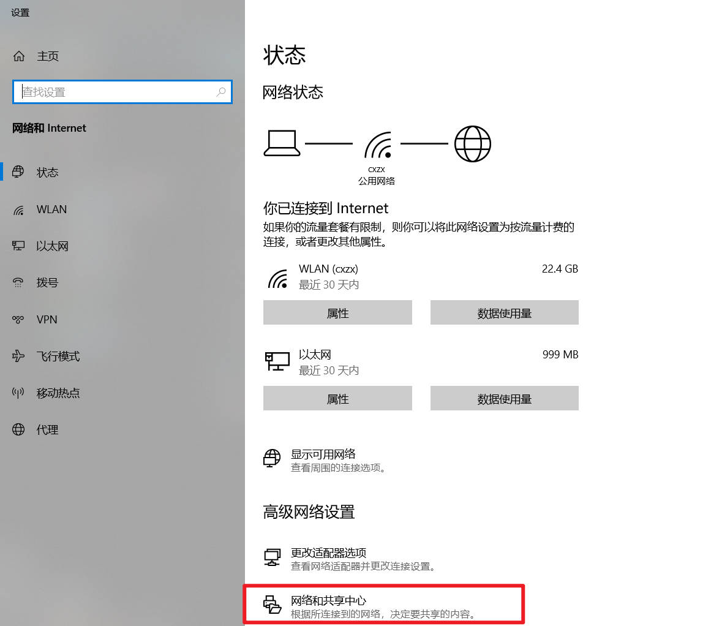
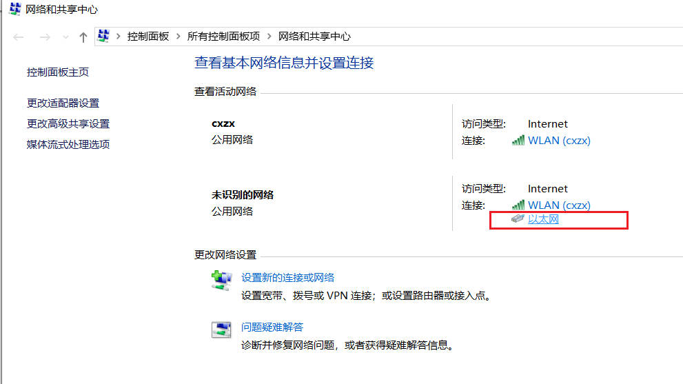
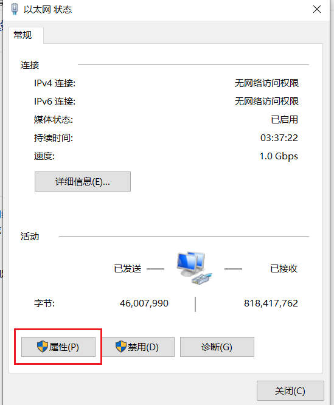
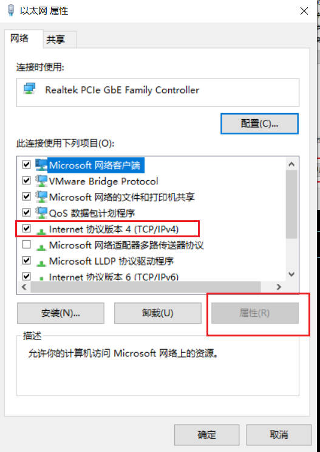
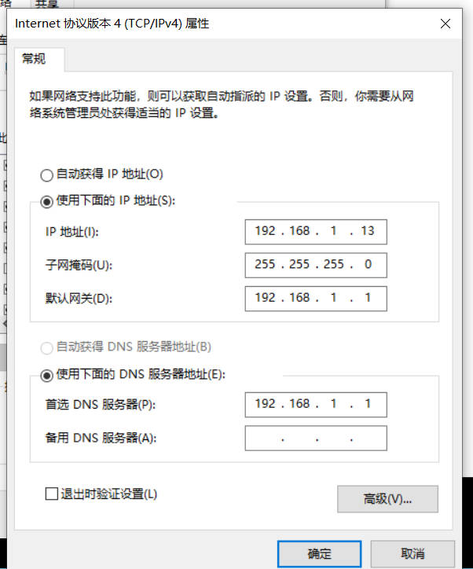
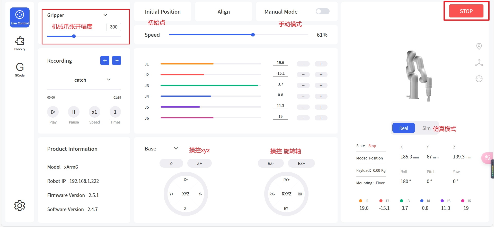
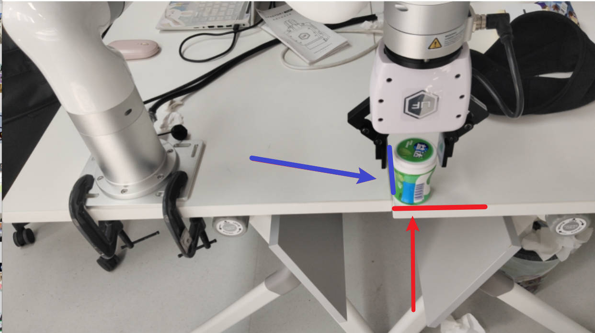

# 1
## 机械臂安装
https://www.cn.ufactory.cc/xarm-download  
下载用户手册，进行安装
实验室机械臂型号为xarm 6
## connect xarm
### network config







ping 192.168.1.222 to check the connection  


#### 访问ufactory studio
ip + :18333  
192.168.1.222:18333  


## installation

```
python setup.py install
```


Before running the example, please modify the IP in robot.conf to corresponding IP you want to control.  
robot ip:192.168.1.222  


## test 
默认物体放置于水平面 进行抓取  
api_test\example\wrapper\target_on_horizon_plane.py  
运行脚本，控制台输入：  
**请输入物品顶部中心坐标x, y, z（用逗号分隔）**：63,413,83  
**请输入物体的宽（单位mm）**：55  
**请输入物体的高（单位mm）**:83  
**请输入抓取轴向量的三个分量:**0.0,0.0,1.0  

如图所示，将口香糖盒放置于此处，物体顶部中心坐标大约为（63,413,83）



测试  
api_test\example\wrapper\test_xarm.py


